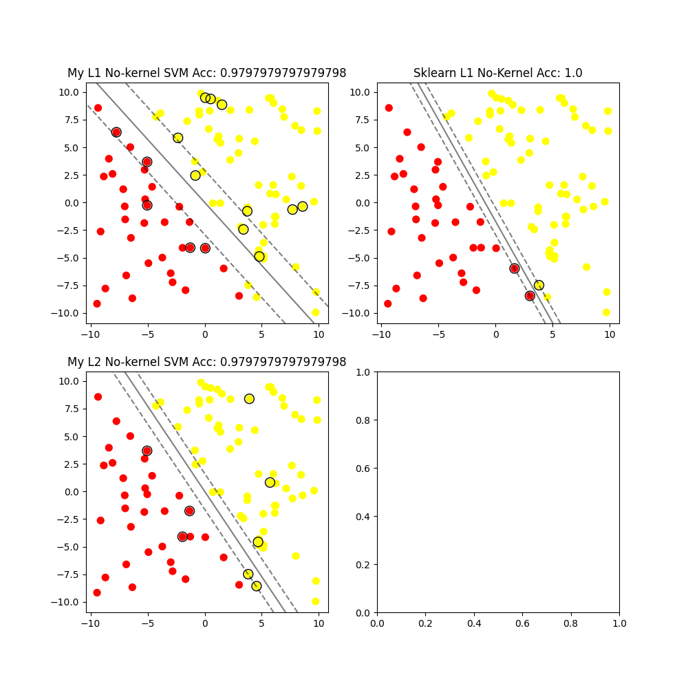

<h2 align="center">Hand-written SVM Without Libraries</h1>

It realizes a unified interface, with more comments and friendly novice~

Pull requests and issues are highly welcomed，Leave a star if it is helpful ! Thanks~

### Directory structure

```tree
│   .gitignore
│   Circle.csv # Nonlinear separable data set
│   Last-Circle.csv.png # Experimental results of nonlinear separable data sets
│   Last-linear_hard_margin.csv.png # Experimental results of linear separable data set
│   Last.png # Effect of the last experiment
│   linear_hard_margin.csv # Linearly separable data set
│   main.py # Entry
│   myplot.png # The effect of a certain time is better
│   README-en.md
│   README.md
└───model
    │   SVM.py
    └───algorithm
        │   kernels.py
        │   smo.py
        └───utils.py # Visualization tools
```

### After All



### License

GPL